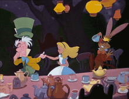
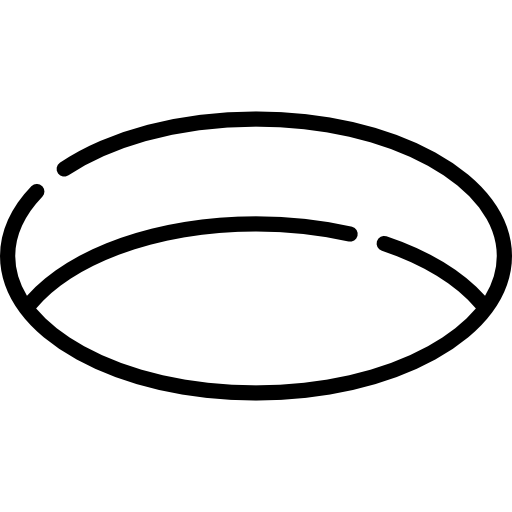

## Ah, splendid! You've found my chaos GitHub   Tumble down the rabbit hole we go 🕳️ !

 under rebuild

--

   i finally discovered what's wrong with my brain: 
   on the left side there is nothing right,and on the right side there is nothing left 
   ...

 
