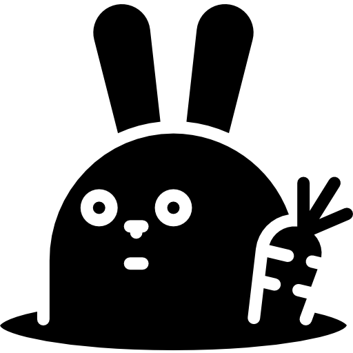
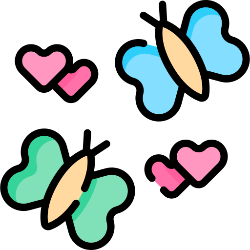

## Ah, splendid! You've found my chaos GitHub   Tumble down the rabbit hole we go 🕳️ !

 Welcome to my Mad Tea Party of Commits, a place where commits are curious and the code is even curiouser!  
 While I may not always find the quickest way out of a maze, I enjoy every twist and turn, attempting to transform bugs into butterflies . Occasionally, a few turns into 'buggerflies', and rejoin their buggerlife adventures <(*Ü*)><i>*external laughter, internal chaos*</i> .  

 [...][linktree]

### You can also find me here :

[][linkedin]
[][resume]
[][portfolio]
[][other github]
  

---

### Languages and Tools :

&nbsp 

[linkedin]: https://linkedin.com/in/phganh
[resume]: https://bit.ly/3NS3fXs
[portfolio]: https://phganh.dev
[other github]: https://github.com/phganh
[linktree]: https://linktr.ee/phganh

<!-- 

  </img>

 -->
<!--  -->
